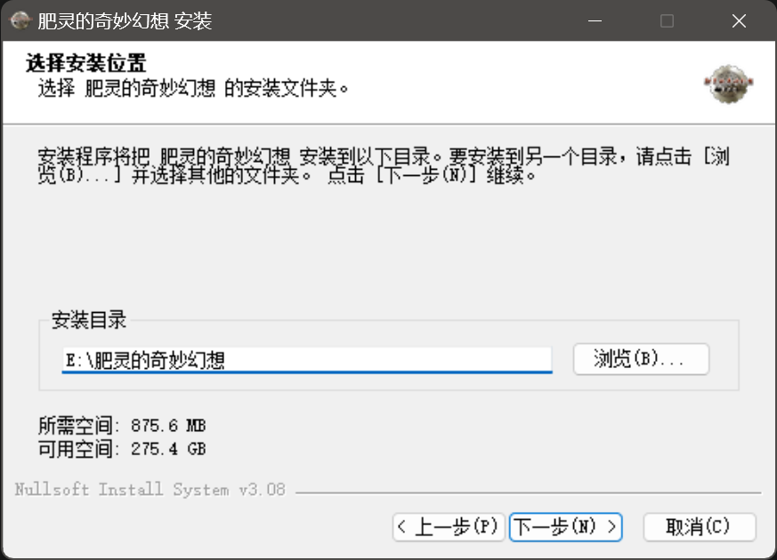

### 客户端下载
客户端分为两部分进行下载, 客户端本体(645.8MB)[[Google Drive(推荐)]](https://drive.google.com/file/d/1dIywrwjLvRDt1vmqtAp5djkWuVl0mVMt/view)/[[百度网盘]](https://pan.baidu.com/s/1xRlKa6J41ddzYB6u-XGdrQ?pwd=mosj), 资源文件(7.55GB)[[Google Drive(推荐)]](https://drive.google.com/file/d/1CL2lrTruU1wh4Bm3tZz1hJ_wMZ-zIRp4/view)/[[百度网盘]](https://pan.baidu.com/s/1pSHdWmHTa19yCbR_qouEkg?pwd=q08t)。


### 客户端安装
- [x] <a>(必选)</a> 安装客户端本体文件。


{.client_figure}

- [ ] <a>(可选)</a> 选择安装目录。


{.client_figure}

- [x] <a>(必选)</a> 完成安装。


{.client_figure}


### 资源文件释放
- [x] <a>(必选)</a> 将下载完成的资源文件(7.55GB)复制到安装目录进行解压, 解压完成后的目录结果如下所示。

```bash
.
├─Fonts
├─ImagePacks2
│   sprite.NPK
│   ...
├─Music
├─SoundPacks
└─7z.exe
  audio.xml
  bdcap32.dll
  ...
```

- [ ] <a>(可选)</a> 删除资源文件压缩包。

### 客户端更新
若不确定客户端版本, 则仅需下载最新的更新包, 选择从<a>更早的版本</a>进行更新既可🎉

- [x] [2024-01-04更新包] - [查看更新内容](../2024-01/8ce13598-925b-401f-93a6-4c5f874177c4.md)<br />　　- 从<a>Ver@0.0.4</a>进行更新(68.6MB) [[Google Drive(推荐)]](https://drive.google.com/file/d/1_177XJrDI2_CA6CITbZcuQquLZPIXHsG/view)/[[百度网盘]](https://pan.baidu.com/s/1C6WKJZGDMns8kL2i176Lig?pwd=73e6)<br />　　- 从<a>更早的版本</a>进行更新(69MB) [[Google Drive(推荐)]](https://drive.google.com/file/d/1hyTBZCENcIc8CqFRTYoU2yJd7JFfEG6r/view)/[[百度网盘]](https://pan.baidu.com/s/1glA1MKcTKdkNbHK7ROSq6A?pwd=fgie)

- [x] [2024-01-02更新包] - [查看更新内容](../2024-01/d79a80f1-14f9-49b3-a966-d15e84329a83.md)<br />　　- 从<a>Ver@0.0.3</a>进行更新(68.8MB) [[Google Drive(推荐)]](https://drive.google.com/file/d/1ta1ejkdXA40xMaRIm4oyJ_7aYTZo1Pcq/view)/[[百度网盘]](https://pan.baidu.com/s/1KnWNYQzFhrNgvifyp_WbLA?pwd=hjbi)<br />　　- 从<a>更早的版本</a>进行更新(68.9MB) [[Google Drive(推荐)]](https://drive.google.com/file/d/1CTqlPgxi8q1GkhzxnJvPV7_0HI1QnquA/view)/[[百度网盘]](https://pan.baidu.com/s/1Wt1Tg79aftkgLCXQfcT9Lg?pwd=jsm4)

- [x] [2024-01-01更新包] - [查看更新内容](../2024-01/76583657-d0f7-4f3f-b797-968832b06c3d.md)<br />　　- 从<a>Ver@0.0.2</a>进行更新(68.6MB) [[Google Drive(推荐)]](https://drive.google.com/file/d/1yTZXsbeD_InVAxmW6TyYH_PMketHEIEc/view)/[[百度网盘]](https://pan.baidu.com/s/1mhlq78dOE0U2rz-zSr4Ztg?pwd=d17p)<br />　　- 从<a>更早的版本</a>进行更新(68.7MB) [[Google Drive(推荐)]](https://drive.google.com/file/d/1fHUxLcG3LTQlEdaz0jhQ2zP-jPlZpqvb/view)/[[百度网盘]](https://pan.baidu.com/s/1AwbFW6gUG8P04skbfPbBOw?pwd=kfmk)

- [x] [2023-12-31更新包] - [查看更新内容](170243c1-608d-44a5-8608-6d78059ed11c.md)<br />　　- 从<a>Ver@0.0.1</a>进行更新(66.2MB) [[Google Drive(推荐)]](https://drive.google.com/file/d/1jJeGzkGf3XlVNVpvFBInQTfPPV2tRjN9/view)/[[百度网盘]](https://pan.baidu.com/s/1laB9nH9Z8_wbtS0t2bVoJQ?pwd=thw1)
