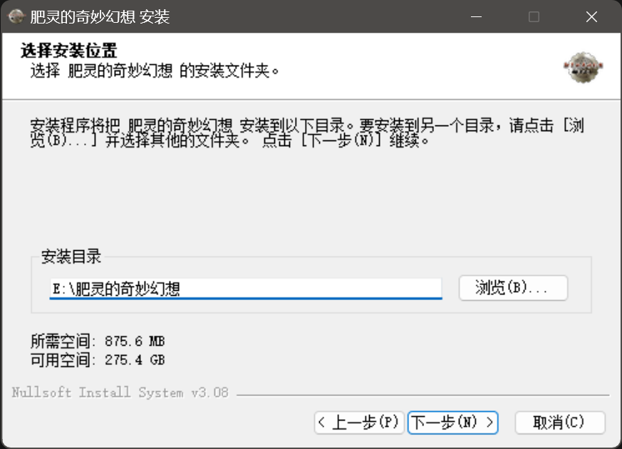

### 客户端下载
- [x] <a>(必选)</a> [[下载客户端]](http://43.136.185.119:5244/d/RFOClient/App/%E8%82%A5%E7%81%B5%E7%9A%84%E5%A5%87%E5%A6%99%E5%B9%BB%E6%83%B3_x64-setup.exe?sign=vMSVetNq4jIzakRvkPTFCeuQkazn6fHRVCrozVwsOYc=:0)。

::: info
<a>客户端</a>只适用于<a>`Windows10+`</a>系统, <a>`Windows7`</a>/<a>`Windows8.1`</a>用户请先升级系统后进行安装。
:::

### 客户端安装
- [x] <a>(必选)</a> 安装客户端文件。

{.client_figure}

- [ ] <a>(可选)</a> 选择安装目录。

{.client_figure}

- [x] <a>(必选)</a> 完成安装。

{.client_figure}

### 历史更新

- [x] [2025-03-20更新公告] - [查看更新内容](../2025-03/3b9dee94-e6e1-4da8-839f-a05012754ec0.md)

 
查看更多更新记录

- [x] [2025-03-11更新公告] - [查看更新内容](../2025-03/961b5aca-d52b-4cd3-ae19-7871e30eb6ad.md)

- [x] [2025-03-07更新公告] - [查看更新内容](../2025-03/ada2c1cf-923a-44b6-8946-cebd303dec22.md)

- [x] [2025-02-23更新公告] - [查看更新内容](../2025-02/7524d436-4314-49a1-9b33-0f6bf2a21d14.md)

- [x] [2025-02-12更新公告] - [查看更新内容](../2025-02/49a52a6d-a302-4463-adbe-2300a0746901.md)

- [x] [2025-02-11更新公告] - [查看更新内容](../2025-02/1b38cffc-be08-40cf-bd29-cac0b035192a.md)

- [x] [2025-02-03更新公告] - [查看更新内容](../2025-02/eb27464c-b799-416a-9931-b7dcea7e6386.md)

- [x] [2025-01-27更新公告] - [查看更新内容](../2025-01/40035c31-38f5-4f8c-b7bd-593c156535ce.md)

- [x] [2025-01-20更新公告] - [查看更新内容](../2025-01/1ea0c718-12dc-476d-8f9c-452e99bb09b6.md)

- [x] [2025-01-17更新公告] - [查看更新内容](../2025-01/35be9a9d-5622-4ad1-8dd5-8f765c2951ca.md)

- [x] [2025-01-16更新公告] - [查看更新内容](../2025-01/f3b0ff57-0ca9-4901-9f6d-8f9b753374ff.md)

- [x] [2025-01-05更新公告] - [查看更新内容](../2025-01/85bbbb9f-3ec1-49c0-8bc6-0293b691d649.md)

- [x] [2024-12-21更新公告] - [查看更新内容](../2024-12/a6aabfba-a199-4b28-82ff-590c7c3b5c96.md)

- [x] [2024-12-20更新公告] - [查看更新内容](../2024-12/a8fe8f2f-ebbd-41ee-b416-95ae83ee5b31.md)

- [x] [2024-12-15更新公告] - [查看更新内容](../2024-12/eebf21cc-d981-4ed5-9d3b-dc3aeb84d47f.md)

- [x] [2024-12-08更新公告] - [查看更新内容](../2024-12/5f5f8de2-3a3c-4a88-950d-4d76ce4b4a53.md)

- [x] [2024-11-24更新公告] - [查看更新内容](../2024-11/e0169e1d-fb35-433b-b588-b2cac3c49204.md)

- [x] [2024-11-23更新公告] - [查看更新内容](../2024-11/99c1a59e-fc83-4c67-876a-4751c83474bf.md)

- [x] [2024-11-21更新公告] - [查看更新内容](../2024-11/c6b2f4cf-a637-424a-bd8d-53e32a55a7ff.md)

- [x] [2024-11-19更新公告] - [查看更新内容](../2024-11/73ff7ba6-a560-4082-b60f-057d3b4cf6a4.md)

- [x] [2024-11-13更新公告] - [查看更新内容](../2024-11/82011da7-ffda-4fd5-8a71-fc07eda64d78.md)

- [x] [2024-11-10更新公告] - [查看更新内容](../2024-11/09452ab4-4d1c-4cad-8564-9c79037ea8f2.md)

- [x] [2024-10-26更新包] - [查看更新内容](../2024-10/2ba484ec-446e-4bdd-baf1-0b9f1894ac19.md)
　　- 从<a>Ver@0.1.51</a>进行更新(123.0MB) ~~[[立即下载]]()~~
　　- 从<a>更早的版本</a>进行更新(693.5MB) ~~[[立即下载]]()~~

- [x] [2024-10-10更新包] - [查看更新内容](../2024-10/cb6d9e1b-5831-4a11-9220-ae55640805ae.md)
　　- 从<a>Ver@0.1.50</a>进行更新(64.9MB) ~~[[立即下载]]()~~
　　- 从<a>更早的版本</a>进行更新(689.9MB) ~~[[立即下载]]()~~

- [x] [2024-09-26更新包] - [查看更新内容](../2024-09/ee59fc92-591a-4db0-af92-7fbb9ae6ce93.md)　
　　- 从<a>Ver@0.1.49</a>进行更新(153.6MB) ~~[[立即下载]]()~~
　　- 从<a>更早的版本</a>进行更新(690.1MB) ~~[[立即下载]]()~~

- [x] [2024-09-19更新包] - [查看更新内容](../2024-09/9d763683-3b19-4497-8acf-d4ee17afe81b.md)　
　　- 从<a>Ver@0.1.48</a>进行更新(98.2MB) ~~[[立即下载]]()~~
　　- 从<a>更早的版本</a>进行更新(688.7MB) ~~[[立即下载]]()~~

- [x] [2024-09-15更新包] - [查看更新内容](../2024-09/c321ab7a-443f-4e2b-bff9-9d9729fd38f7.md)　
　　- 从<a>Ver@0.1.47</a>进行更新(80.0MB) ~~[[立即下载]]()~~
　　- 从<a>更早的版本</a>进行更新(673.8MB) ~~[[立即下载]]()~~

- [x] [2024-08-15更新包] - [查看更新内容](../2024-08/e5df1d9d-08cf-4bb5-95cd-a4060639d29e.md)　
　　- 从<a>Ver@0.1.46</a>进行更新(65.3MB) ~~[[立即下载]]()~~
　　- 从<a>更早的版本</a>进行更新(673.8MB) ~~[[立即下载]]()~~

- [x] [2024-08-07更新包] - [查看更新内容](../2024-08/1a52591e-489b-4fe6-bb04-a60496fd01c2.md)　
　　- 从<a>Ver@0.1.45</a>进行更新(65.2MB) ~~[[立即下载]]()~~
　　- 从<a>更早的版本</a>进行更新(673.6MB) ~~[[立即下载]]()~~

- [x] [2024-08-06更新包] - [查看更新内容](../2024-08/d6d4d466-b746-41e5-8df7-47cef4664d77.md)　
　　- 从<a>Ver@0.1.44</a>进行更新(220.3MB) ~~[[立即下载]]()~~
　　- 从<a>更早的版本</a>进行更新(673.5MB) ~~[[立即下载]]()~~

- [x] [2024-08-04更新包] - [查看更新内容](../2024-08/cc24635b-d8fb-473d-ad7f-5a79e5c7b9e2.md)　
　　- 从<a>Ver@0.1.43</a>进行更新(68.0MB) ~~[[立即下载]]()~~
　　- 从<a>更早的版本</a>进行更新(518.4MB) ~~[[立即下载]]()~~

- [x] [2024-08-01更新包] - [查看更新内容](../2024-08/5701b55b-98cc-4b25-a1b6-a31224b5e0ed.md)　
　　- 从<a>Ver@0.1.42</a>进行更新(121.0MB) ~~[[立即下载]]()~~
　　- 从<a>更早的版本</a>进行更新(515.7MB) ~~[[立即下载]]()~~

- [x] [2024-07-29更新包] - [查看更新内容](../2024-07/ae745071-82cd-4f42-8f60-734d95288d71.md)　
　　- 从<a>Ver@0.1.41</a>进行更新(121.0MB) ~~[[立即下载]]()~~
　　- 从<a>更早的版本</a>进行更新(515.0MB) ~~[[立即下载]]()~~

- [x] [2024-07-27更新包] - [查看更新内容](../2024-07/bd6b7269-c5bf-4361-9f6d-84452e3a4fdf.md)　
　　- 从<a>Ver@0.1.40</a>进行更新(65.0MB) ~~[[立即下载]]()~~
　　- 从<a>更早的版本</a>进行更新(512.2MB) ~~[[立即下载]]()~~

- [x] [2024-07-26更新包] - [查看更新内容](../2024-07/b533eaca-f958-4c1b-92f2-e79cdb8964a7.md)　
　　- 从<a>Ver@0.1.39</a>进行更新(65.2MB) ~~[[立即下载]]()~~
　　- 从<a>更早的版本</a>进行更新(512.3MB) ~~[[立即下载]]()~~

- [x] [2024-07-22更新包] - [查看更新内容](../2024-07/2630a11d-7d48-4766-a360-43de4125317d.md)　
　　- 从<a>Ver@0.1.38</a>进行更新(64.9MB) ~~[[立即下载]]()~~
　　- 从<a>更早的版本</a>进行更新(512.2MB) ~~[[立即下载]]()~~

- [x] [2024-07-20更新包] - [查看更新内容](../2024-07/4b0f702d-9c45-4bdc-8f2e-3b819e1b8700.md)　
　　- 从<a>Ver@0.1.37</a>进行更新(70.6MB) ~~[[立即下载]]()~~
　　- 从<a>更早的版本</a>进行更新(512.3MB) ~~[[立即下载]]()~~

- [x] [2024-07-15更新包] - [查看更新内容](../2024-07/a25432e5-62dc-4e7d-9616-3b6065a4511a.md)　
　　- 从<a>Ver@0.1.36</a>进行更新(137.9MB) ~~[[立即下载]]()~~
　　- 从<a>更早的版本</a>进行更新(512.1MB) ~~[[立即下载]]()~~

- [x] [2024-07-06更新包] - [查看更新内容](../2024-07/051ac32f-6e88-4b48-bd6b-624418ad8632.md)　
　　- 从<a>Ver@0.1.35</a>进行更新(65.3MB) ~~[[立即下载]]()~~
　　- 从<a>更早的版本</a>进行更新(501.7MB) ~~[[立即下载]]()~~

- [x] [2024-07-05更新包] - [查看更新内容](../2024-07/b83d7cc0-b051-443f-89a9-f869e7ee4bb3.md)　
　　- 从<a>Ver@0.1.34</a>进行更新(451.0MB) ~~[[立即下载]]()~~
　　- 从<a>更早的版本</a>进行更新(501.5MB) ~~[[立即下载]]()~~

- [x] [2024-06-20更新包] - [查看更新内容](../2024-06/99e1e541-c4f8-4ff9-a945-9adcf678581e.md)　
　　- 从<a>Ver@0.1.33</a>进行更新(67.9MB) ~~[[立即下载]]()~~
　　- 从<a>更早的版本</a>进行更新(124.2MB) ~~[[立即下载]]()~~

- [x] [2024-06-18更新包] - [查看更新内容](../2024-06/6b1c81c2-7f19-4e89-b094-fc230f4d40fa.md)　
　　- 从<a>Ver@0.1.32</a>进行更新(67.8MB) ~~[[立即下载]]()~~
　　- 从<a>更早的版本</a>进行更新(124.2MB) ~~[[立即下载]]()~~

- [x] [2024-06-17更新包] - [查看更新内容](../2024-06/3563484b-bcfa-4e9f-994a-4ae8e26c26b0.md)　
　　- 从<a>Ver@0.1.31</a>进行更新(73.5MB) ~~[[立即下载]]()~~
　　- 从<a>更早的版本</a>进行更新(124.2MB) ~~[[立即下载]]()~~

- [x] [2024-06-16更新包] - [查看更新内容](../2024-06/b891fbd5-3441-43fb-841d-d8aad7ada497.md)　
　　- 从<a>Ver@0.1.30</a>进行更新(70.0MB) ~~[[立即下载]]()~~
　　- 从<a>更早的版本</a>进行更新(118.4MB) ~~[[立即下载]]()~~

- [x] [2024-06-06更新包] - [查看更新内容](../2024-06/afd8c09b-2a2d-4254-b271-c45aff4e6b5a.md)　
　　- 从<a>Ver@0.1.29</a>进行更新(77.6MB) ~~[[立即下载]]()~~
　　- 从<a>更早的版本</a>进行更新(118.4MB) ~~[[立即下载]]()~~

- [x] [2024-06-01更新包] - [查看更新内容](../2024-06/d927dd76-1ddf-4404-92e2-ed40cdc9c16f.md)　
　　- 从<a>Ver@0.1.28</a>进行更新(67.8MB)  ~~[[立即下载]]()~~
　　- 从<a>更早的版本</a>进行更新(108.7MB)  ~~[[立即下载]]()~~

- [x] [2024-05-10更新包] - [查看更新内容](../2024-05/cd3da0c9-9501-4e2b-a86c-f7fef58fcfdd.md)　
　　- 从<a>Ver@0.1.27</a>进行更新(68.6MB) ~~[[立即下载]]()~~
　　- 从<a>更早的版本</a>进行更新(109.5MB) ~~[[立即下载]]()~~

- [x] [2024-05-09更新包] - [查看更新内容](../2024-05/b0fcb687-2883-41d5-a173-c17f93ea940d.md)　
　　- 从<a>Ver@0.1.26</a>进行更新(86.4MB) ~~[[立即下载]]()~~
　　- 从<a>更早的版本</a>进行更新(109.5MB) ~~[[立即下载]]()~~

- [x] [2024-04-28更新包] - [查看更新内容](../2024-04/b25ff3bd-6f0c-46de-a738-017cbc84f657.md)　
　　- 从<a>Ver@0.1.25</a>进行更新(68.8MB) ~~[[立即下载]]()~~
　　- 从<a>更早的版本</a>进行更新(91.7MB) ~~[[立即下载]]()~~

- [x] [2024-04-19更新包] - [查看更新内容](../2024-04/fc008b67-0548-47ac-bd68-084500e82d0c.md)　
　　- 从<a>Ver@0.1.24</a>进行更新(68.8MB) ~~[[立即下载]]()~~
　　- 从<a>更早的版本</a>进行更新(91.7MB) ~~[[立即下载]]()~~

- [x] [2024-04-18更新包] - [查看更新内容](../2024-04/a0c378ad-0874-4f9a-937f-f5b66d94567d.md)　
　　- 从<a>Ver@0.1.23</a>进行更新(69.3MB) ~~[[立即下载]]()~~
　　- 从<a>更早的版本</a>进行更新(91.5MB) ~~[[立即下载]]()~~

- [x] [2024-04-15更新包] - [查看更新内容](../2024-04/347b2b8b-35cd-4f75-bd4e-1784e85b1195.md)　
　　- 从<a>Ver@0.1.22</a>进行更新(68.9MB) ~~[[立即下载]]()~~
　　- 从<a>更早的版本</a>进行更新(91.4MB) ~~[[立即下载]]()~~

- [x] [2024-04-12更新包] - [查看更新内容](../2024-04/65c34b89-e724-462f-91c9-519a190984b6.md)　
　　- 从<a>Ver@0.1.21</a>进行更新(68.6MB) ~~[[立即下载]]()~~
　　- 从<a>更早的版本</a>进行更新(91MB) ~~[[立即下载]]()~~

- [x] [2024-04-10更新包] - [查看更新内容](../2024-04/1d754013-b2fb-4869-a8b9-372bd6239756.md)　
　　- 从<a>Ver@0.1.20</a>进行更新(81.4MB) ~~[[立即下载]]()~~
　　- 从<a>更早的版本</a>进行更新(91MB) ~~[[立即下载]]()~~

- [x] [2024-04-07更新包] - [查看更新内容](../2024-04/69a41eaa-ad73-41d1-9a8c-ba1b08100b56.md)　
　　- 从<a>Ver@0.1.19</a>进行更新(68.6MB) ~~[[立即下载]]()~~
　　- 从<a>更早的版本</a>进行更新(78.3MB) ~~[[立即下载]]()~~

- [x] [2024-04-06更新包] - [查看更新内容](../2024-04/5031421f-c436-462f-93aa-4cfc181a11d0.md)　
　　- 从<a>Ver@0.1.18</a>进行更新(69MB) ~~[[立即下载]]()~~
　　- 从<a>更早的版本</a>进行更新(78.3MB) ~~[[立即下载]]()~~

- [x] [2024-04-03更新包] - [查看更新内容](../2024-04/1d15893c-e903-474e-bed8-5167d7d706ea.md) 　　- 从<a>Ver@0.1.17</a>进行更新(71.6MB) ~~<a>[Google Drive(推荐)]</a>~~/~~<a>[百度网盘]</a>~~ 　　- 从<a>更早的版本</a>进行更新(77.9MB) ~~<a>[Google Drive(推荐)]</a>~~/~~<a>[百度网盘]</a>~~

- [x] [2024-04-02更新包] - [查看更新内容](../2024-04/bc12e67d-3141-4747-aa88-8e37a9f998e4.md) 　　- 从<a>Ver@0.1.16</a>进行更新(68.7MB) ~~<a>[Google Drive(推荐)]</a>~~/~~<a>[百度网盘]</a>~~ 　　- 从<a>更早的版本</a>进行更新(75MB) ~~<a>[Google Drive(推荐)]</a>~~/~~<a>[百度网盘]</a>~~

- [x] [2024-04-01更新包] - [查看更新内容](../2024-04/a3f1e4a3-0e5f-4855-a6ef-5ee8e6875298.md) 　　- 从<a>Ver@0.1.15</a>进行更新(68.6MB) ~~<a>[Google Drive(推荐)]</a>~~/~~<a>[百度网盘]</a>~~ 　　- 从<a>更早的版本</a>进行更新(75MB) ~~<a>[Google Drive(推荐)]</a>~~/~~<a>[百度网盘]</a>~~

- [x] [2024-03-29更新包] - [查看更新内容](../2024-03/bf1942f1-477d-4b0b-9451-b96c1a052005.md) 　　- 从<a>Ver@0.1.14</a>进行更新(70.8MB) ~~<a>[Google Drive(推荐)]</a>~~/~~<a>[百度网盘]</a>~~ 　　- 从<a>更早的版本</a>进行更新(75MB) ~~<a>[Google Drive(推荐)]</a>~~/~~<a>[百度网盘]</a>~~

- [x] [2024-03-19更新包] - [查看更新内容](../2024-03/accdd904-6604-4d96-b0eb-9f0776cfcf03.md) 　　- 从<a>Ver@0.1.13</a>进行更新(68.7MB) ~~<a>[Google Drive(推荐)]</a>~~/~~<a>[百度网盘]</a>~~ 　　- 从<a>更早的版本</a>进行更新(72.9MB) ~~<a>[Google Drive(推荐)]</a>~~/~~<a>[百度网盘]</a>~~

- [x] [2024-03-16更新包] - [查看更新内容](../2024-03/30013ea3-97fa-408b-91a7-1af78cc6a670.md) 　　- 从<a>Ver@0.1.12</a>进行更新(70.9MB) ~~<a>[Google Drive(推荐)]</a>~~/~~<a>[百度网盘]</a>~~ 　　- 从<a>更早的版本</a>进行更新(72.8MB) ~~<a>[Google Drive(推荐)]</a>~~/~~<a>[百度网盘]</a>~~

- [x] [2024-03-11更新包] - [查看更新内容](../2024-03/e33dc64d-ad8c-44b0-9eba-b8b9a3237817.md) 　　- 从<a>Ver@0.1.11</a>进行更新(68.7MB) ~~<a>[Google Drive(推荐)]</a>~~/~~<a>[百度网盘]</a>~~ 　　- 从<a>更早的版本</a>进行更新(70.6MB) ~~<a>[Google Drive(推荐)]</a>~~/~~<a>[百度网盘]</a>~~

- [x] [2024-03-08更新包] - [查看更新内容](../2024-03/7851d9fd-a393-466d-a58a-4718117e2d48.md) 　　- 从<a>Ver@0.1.10</a>进行更新(68.7MB) ~~<a>[Google Drive(推荐)]</a>~~/~~<a>[百度网盘]</a>~~ 　　- 从<a>更早的版本</a>进行更新(70.6MB) ~~<a>[Google Drive(推荐)]</a>~~/~~<a>[百度网盘]</a>~~

- [x] [2024-03-04更新包] - [查看更新内容](../2024-03/9850938e-a268-49cd-9e8b-7c20e37d0b40.md) 　　- 从<a>Ver@0.1.9</a>进行更新(68.7MB) ~~<a>[Google Drive(推荐)]</a>~~/~~<a>[百度网盘]</a>~~ 　　- 从<a>更早的版本</a>进行更新(70.6MB) ~~<a>[Google Drive(推荐)]</a>~~/~~<a>[百度网盘]</a>~~

- [x] [2024-03-02更新包] - [查看更新内容](../2024-03/6c0649b2-9151-454a-b913-b9d16f3abaf6.md) 　　- 从<a>Ver@0.1.8</a>进行更新(68.7MB) ~~<a>[Google Drive(推荐)]</a>~~/~~<a>[百度网盘]</a>~~ 　　- 从<a>更早的版本</a>进行更新(70.6MB) ~~<a>[Google Drive(推荐)]</a>~~/~~<a>[百度网盘]</a>~~

- [x] [2024-02-29更新包] - [查看更新内容](../2024-02/5680dbe0-d822-4405-8f40-391af8f4defd.md) 　　- 从<a>Ver@0.1.7</a>进行更新(9.8MB) ~~<a>[Google Drive(推荐)]</a>~~/~~<a>[百度网盘]</a>~~ 　　- 从<a>更早的版本</a>进行更新(70.6MB) ~~<a>[Google Drive(推荐)]</a>~~/~~<a>[百度网盘]</a>~~

- [x] [2024-02-28更新包] - [查看更新内容](../2024-02/fa1e445b-dff6-42ca-add8-a77a42675359.md) 　　- 从<a>Ver@0.1.6</a>进行更新(69MB) ~~<a>[Google Drive(推荐)]</a>~~/~~<a>[百度网盘]</a>~~ 　　- 从<a>更早的版本</a>进行更新(70.6MB) ~~<a>[Google Drive(推荐)]</a>~~/~~<a>[百度网盘]</a>~~

- [x] [2024-02-27更新包] - [查看更新内容](../2024-02/58a2ce87-97a3-47c2-8555-f62b8642f86b.md) 　　- 从<a>Ver@0.1.5</a>进行更新(68.6MB) ~~<a>[Google Drive(推荐)]</a>~~/~~<a>[百度网盘]</a>~~ 　　- 从<a>更早的版本</a>进行更新(70.3MB) ~~<a>[Google Drive(推荐)]</a>~~/~~<a>[百度网盘]</a>~~

- [x] [2024-02-26更新包] - [查看更新内容](../2024-02/d2989548-9aad-46d0-80ee-f92ac6b228fb.md) 　　- 从<a>Ver@0.1.4</a>进行更新(68.6MB) ~~<a>[Google Drive(推荐)]</a>~~/~~<a>[百度网盘]</a>~~ 　　- 从<a>更早的版本</a>进行更新(70.2MB) ~~<a>[Google Drive(推荐)]</a>~~/~~<a>[百度网盘]</a>~~

- [x] [2024-02-23更新包] - [查看更新内容](../2024-02/9369c207-9d4e-4056-9f91-60245bcb98e2.md) 　　- 从<a>Ver@0.1.3</a>进行更新(69MB) ~~<a>[Google Drive(推荐)]</a>~~/~~<a>[百度网盘]</a>~~ 　　- 从<a>更早的版本</a>进行更新(70.3MB) ~~<a>[Google Drive(推荐)]</a>~~/~~<a>[百度网盘]</a>~~

- [x] [2024-02-21更新包] - [查看更新内容](../2024-02/c25ea640-1a9a-40c7-b8fc-e54a71bd0a91.md) 　　- 从<a>Ver@0.1.2</a>进行更新(68.8MB) ~~<a>[Google Drive(推荐)]</a>~~/~~<a>[百度网盘]</a>~~ 　　- 从<a>更早的版本</a>进行更新(70.1MB) ~~<a>[Google Drive(推荐)]</a>~~/~~<a>[百度网盘]</a>~~

- [x] [2024-02-18更新包] - [查看更新内容](../2024-02/5c3ad5b4-ecf9-49b2-bb99-940609ab29c3.md) 　　- 从<a>Ver@0.1.1</a>进行更新(68.8MB) ~~<a>[Google Drive(推荐)]</a>~~/~~<a>[百度网盘]</a>~~ 　　- 从<a>更早的版本</a>进行更新(70.1MB) ~~<a>[Google Drive(推荐)]</a>~~/~~<a>[百度网盘]</a>~~

- [x] [2024-02-16更新包] - [查看更新内容](../2024-02/641911d6-5b26-45ca-aef4-0cfe9a8f7c12.md) 　　- 从<a>Ver@0.1.0</a>进行更新(70.1MB) ~~<a>[Google Drive(推荐)]</a>~~/~~<a>[百度网盘]</a>~~ 　　- 从<a>更早的版本</a>进行更新(70.1MB) ~~<a>[Google Drive(推荐)]</a>~~/~~<a>[百度网盘]</a>~~

---
- [x] [2024-02-07更新包<a>[内测]</a>] - [查看更新内容](../2024-02/12d90ad0-aeb4-45fc-81d6-a89810b5e192.md) 　　- 从<a>Ver@0.0.17</a>进行更新(68.6MB) ~~<a>[Google Drive(推荐)]</a>~~/~~<a>[百度网盘]</a>~~

- [x] [2024-02-06更新包<a>[内测]</a>] - [查看更新内容](../2024-02/68b7cf8d-ff3a-4235-af69-439f6b14001f.md) 　　- 从<a>Ver@0.0.16</a>进行更新(68.6MB) ~~<a>[Google Drive(推荐)]</a>~~/~~<a>[百度网盘]</a>~~

- [x] [2024-02-05更新包<a>[内测]</a>] - [查看更新内容](../2024-02/807dfb85-9ef8-4b38-a2ff-16280106319d.md) 　　- 从<a>Ver@0.0.15</a>进行更新(68.6MB) ~~<a>[Google Drive(推荐)]</a>~~/~~<a>[百度网盘]</a>~~

- [x] [2024-02-04更新包<a>[内测]</a>] - [查看更新内容](../2024-02/8e213010-6651-4305-911b-7545d411804b.md) 　　- 从<a>Ver@0.0.14</a>进行更新(68.6MB) ~~<a>[Google Drive(推荐)]</a>~~/~~<a>[百度网盘]</a>~~

- [x] [2024-02-03更新包<a>[内测]</a>] - [查看更新内容](../2024-02/a0436542-6366-4623-8c5b-9735fa25a816.md) 　　- 从<a>Ver@0.0.13</a>进行更新(222.6MB) ~~<a>[Google Drive(推荐)]</a>~~/~~<a>[百度网盘]</a>~~

- [x] [2024-02-01更新包<a>[内测]</a>] - [查看更新内容](../2024-02/c9bfefc1-ae26-43ca-b1f2-3b399a82044b.md) 　　- 从<a>Ver@0.0.12</a>进行更新(68.6MB) ~~<a>[Google Drive(推荐)]</a>~~/~~<a>[百度网盘]</a>~~

- [x] [2024-01-29更新包<a>[内测]</a>] - [查看更新内容](../2024-01/bb7e9d56-56ee-4e3a-8d17-eb8e6d24f02d.md) 　　- 从<a>Ver@0.0.11</a>进行更新(68.7MB) ~~<a>[Google Drive(推荐)]</a>~~/~~<a>[百度网盘]</a>~~

- [x] [2024-01-24更新包<a>[内测]</a>] - [查看更新内容](../2024-01/c1c3789e-18d9-471e-9ba9-13cc83fc1adf.md) 　　- 从<a>Ver@0.0.10</a>进行更新(68.7MB) ~~<a>[Google Drive(推荐)]</a>~~/~~<a>[百度网盘]</a>~~

- [x] [2024-01-22更新包<a>[内测]</a>] - [查看更新内容](../2024-01/6af19118-c6c4-4b56-8845-ffa6f1d4d615.md) 　　- 从<a>Ver@0.0.9</a>进行更新(68.8MB) ~~<a>[Google Drive(推荐)]</a>~~/~~<a>[百度网盘]</a>~~

- [x] [2024-01-18更新包<a>[内测]</a>] - [查看更新内容](../2024-01/298cf0ee-cea7-48a8-b4bd-7b713b790eba.md) 　　- 从<a>Ver@0.0.8</a>进行更新(68.8MB) ~~<a>[Google Drive(推荐)]</a>~~/~~<a>[百度网盘]</a>~~

- [x] [2024-01-14更新包<a>[内测]</a>] - [查看更新内容](../2024-01/e020e4b5-3c7d-495c-a23a-3afffde9c6dc.md) 　　- 从<a>Ver@0.0.7</a>进行更新(68.8MB) ~~<a>[Google Drive(推荐)]</a>~~/~~<a>[百度网盘]</a>~~

- [x] [2024-01-08更新包<a>[内测]</a>] - [查看更新内容](../2024-01/b07a0563-eeee-41a0-9e0b-5e3e5c62eaf7.md) 　　- 从<a>Ver@0.0.6</a>进行更新(70.8MB) ~~<a>[Google Drive(推荐)]</a>~~/~~<a>[百度网盘]</a>~~

- [x] [2024-01-05更新包<a>[内测]</a>] - [查看更新内容](../2024-01/a7ce6082-eff5-4785-9841-9216e87df128.md) 　　- 从<a>Ver@0.0.5</a>进行更新(75.7MB) ~~<a>[Google Drive(推荐)]</a>~~/~~<a>[百度网盘]</a>~~

- [x] [2024-01-04更新包<a>[内测]</a>] - [查看更新内容](../2024-01/8ce13598-925b-401f-93a6-4c5f874177c4.md) 　　- 从<a>Ver@0.0.4</a>进行更新(68.6MB) ~~<a>[Google Drive(推荐)]</a>~~/~~<a>[百度网盘]</a>~~

- [x] [2024-01-02更新包<a>[内测]</a>] - [查看更新内容](../2024-01/d79a80f1-14f9-49b3-a966-d15e84329a83.md) 　　- 从<a>Ver@0.0.3</a>进行更新(68.8MB) ~~<a>[Google Drive(推荐)]</a>~~/~~<a>[百度网盘]</a>~~

- [x] [2024-01-01更新包<a>[内测]</a>] - [查看更新内容](../2024-01/76583657-d0f7-4f3f-b797-968832b06c3d.md) 　　- 从<a>Ver@0.0.2</a>进行更新(68.6MB) ~~<a>[Google Drive(推荐)]</a>~~/~~<a>[百度网盘]</a>~~

- [x] [2023-12-31更新包<a>[内测]</a>] - [查看更新内容](../2023-12/170243c1-608d-44a5-8608-6d78059ed11c.md) 　　- 从<a>Ver@0.0.1</a>进行更新(66.2MB) ~~<a>[Google Drive(推荐)]</a>~~/~~<a>[百度网盘]</a>~~

