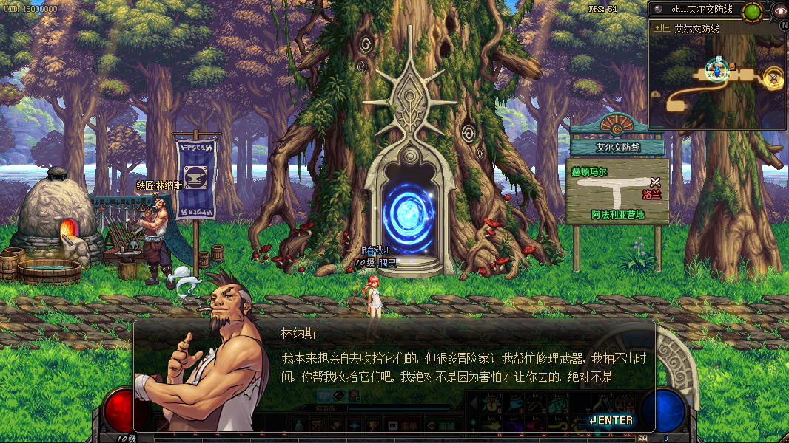
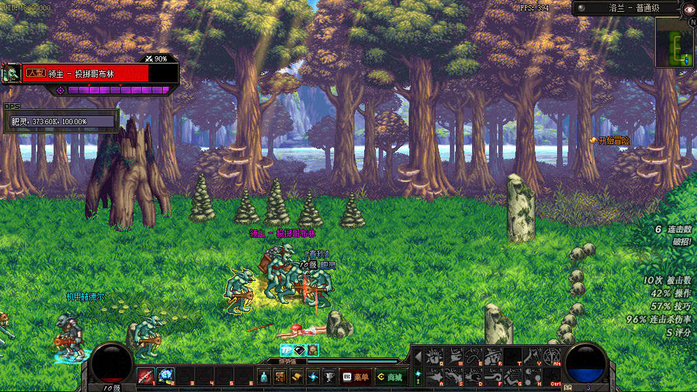
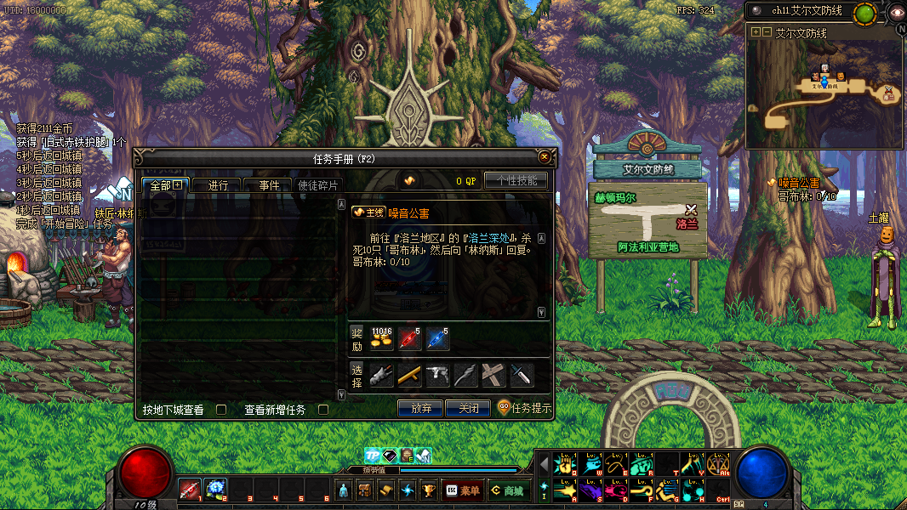
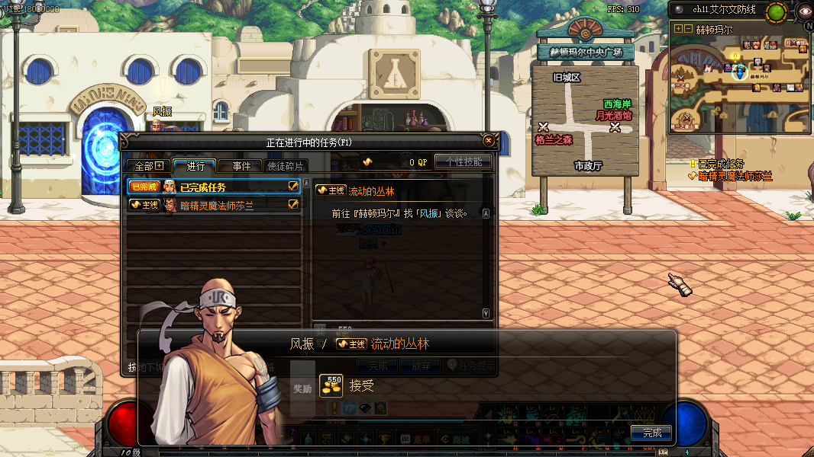

### 铁匠林纳斯

 {style="float:right; max-width:45%; margin-left:1em; margin-top:0px; margin-bottom:0px"}

<a>赛丽亚</a>: 那些胆小的哥布林为什么会突然变得这么狂暴...而且阿拉德大陆最近常常出现这种奇怪的现象...难道...?
___
<a>任务要求</a>
前往『艾尔文防线』拜访铁匠[「林纳斯」](https://rfo.wiki/#)
___
<a>赛丽亚</a>: 啊!对不起,我只顾想事情...您说要去冒险啊?但您好像还不太熟悉周边的环境啊,很多冒险家都是先熟悉周边环境再去冒险的.

<a>赛丽亚</a>: 嗯..您就先去艾尔文防线找林纳斯大叔吧,他是一位手艺超级棒的铁匠,而且很喜欢和冒险家来往,他一定会帮助您的.

<a>林纳斯</a>: 你就是赛丽亚的救命恩人?嗯,看你的样子不太像啊.不过既然你能从哥布林手里救出赛丽亚,我就暂且当你是个不错的人吧!

### 开始冒险

<a>林纳斯</a>: 你还不熟悉艾尔文防线吧?这里是通往精灵圣地格兰之森的惟一入口,不过现在是那些低等生物哥布林的地盘了.

 {style="float:left; max-width:45%; margin-right:1em; margin-top:0px; margin-bottom:0px"}

<a>林纳斯</a>: 唉,这事说来话长,自从格兰之森发生大火灾后,居住在那里的精灵就突然消失了,这一带一直怪事不断呢.

<a>林纳斯</a>: 冒险家,既然你选择来阿拉德大陆冒险,那就先从这里开始吧.

___
<a>任务要求</a>
通关『洛兰地区』的[『洛兰』](https://rfo.wiki/walkthrough/dungeon/lorien.html)
___

<a>林纳斯</a>: 嗯,不错不错,不愧是赛丽亚的救命恩人呐!有点武术基础!呵呵,我有点期待你日后的表现了,好好努力吧!

### 噪音公害

<a>林纳斯</a>: 噢,还有一件事要请你帮忙.你知道吗?那些哥布林不知怎么了,突然往洛兰深处疯狂聚集,周边地区已经陷入一片混乱了.

 {style="float:right; max-width:45%; margin-left:1em; margin-top:0px; margin-bottom:0px"}

<a>林纳斯</a>: 你快去除掉它们吧!不然周边的居民就要遭殃了!

___
<a>任务要求</a>
前往『洛兰地区』的[『洛兰深处』](https://rfo.wiki/walkthrough/dungeon/lorieninside.html),杀死10只[「哥布林」](https://rfo.wiki/walkthrough/monster/goblin.html),然后向「林纳斯」回复.
___

<a>林纳斯</a>: 哈哈,你的身手还不错啊!送你一件武器吧,不要嫌弃我的手艺,你肯定会喜欢它的,呵呵!

### 与赛丽亚的缘分

<a>林纳斯</a>: 看来你打算去冒险了,先去找赛丽亚告别吧,一会我会告诉你这次要去的地方.

___
<a>任务要求</a>
找「赛丽亚」谈谈.
___

<a>赛丽亚</a>: 看来你真的要去冒险了,不用跟我道别,我会一直陪在你身边的...

### 流动的丛林

<a>林纳斯</a>: 你最近成长了不少啊,哈哈,既然我的事情都解决了,你就开始新的冒险吧!你听说过流动的丛林格兰之森吗?冒险家都去那了,你也赶紧去吧!

 {style="float:left; max-width:45%; margin-right:1em; margin-top:0px; margin-bottom:0px"}

<a>林纳斯</a>: 嗯,如果你不知道怎么去,就沿着艾尔文防线左侧走,那里通往赫顿玛尔.然后你去找一个叫风振的人,他会告诉你接下来要做什么.

___
<a>任务要求</a>
前往『赫顿玛尔』找「风振」谈谈.
___

<a>风振</a>: 你是第一次来这儿吧?你想开始新的冒险啊,呵呵,那就从平定格兰之森的混乱开始吧!
